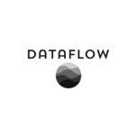
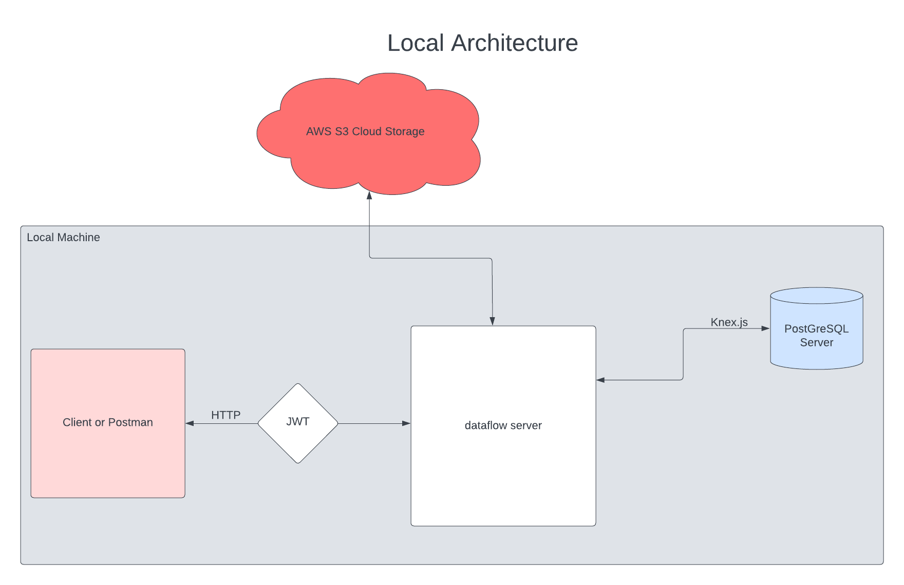
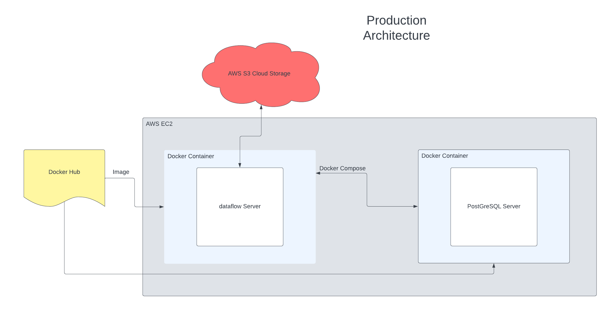

<h1 align="center">
    
    <p align="center" style="font-size: 18px;">
        Streamline your data workflows 🚀
    </p>
</h1>

## Introduction

*dataflow* is a specialized issue tracker designed to streamline and enhance your data science and data analysis projects. The platform offers a unique approach to project management through the concept of *flows*, while also providing an array of additional features tailored to empower your data-related tasks. Whether you're a data scientist, analyst, or enthusiast, *dataflow* is here to optimize your workflow.

Please consider that current development is focused on the backend, core 
architecture, and internal developer tooling. This means a frontend won't 
be 
released in the near future. As such, this repository will document application architecture, APIs, and other non-userfacing concepts.

## Table Of Contents

- [Installation](#installation)
    - [NPM](#npm)
    - [Starting a Server](#starting-a-server)
- [Application Architecture](#application-architecture)
    - [Local Architecture](#local-architecture)
- [Links](#links)

## Installation

### Dependencies

1. Clone the repository and install backend dependencies:

```bash
git clone https://github.com/RyanHUNGry/dataflow.git && cd ./dataflow/backend && npm install
```

2. Create an environment variables file:
```bash
cd backend && touch.env
```

3. Fill out the following environment variables inside `.env`:
```bash
NODE_ENV=... # 

PG_DEV_DATABASE=... # development database
PG_DEV_USERNAME=... 
PG_DEV_PASSWORD=...
PG_DEV_HOST=...

DEV_PORT=...

DEV_JWT_SECRET=...

AWS_PUBLIC_KEY:...
AWS_SECRET_KEY:...
```

### Starting a Server
1. Start a server on default `http://localhost:8000`:
```bash
npm start
```

```bash
# run nodemon process for development
npm run watch
```

2. Ping the API with a tool such as [Postman](https://www.google.com/search?q=postman&oq=Postman&aqs=chrome.0.0i433i512l2j69i64j0i433i512j0i512l3j5.1765j0j7&sourceid=chrome&ie=UTF-8)

## Application Architecture

### Environments
*dataflow* has a traditional three environment setup using environment variables to dictate development, test, and production settings.

### AWS RDS
*dataflow* uses AWS RDS PostgreSQL instances for data storage. There are three databases inside the instance for development, test, and production. Connection to *dataflow* is facilitated via PostgreSQL connection protocol with SSL encryption.

### AWS S3
*dataflow* uses AWS S3 buckets to store datasets related to a *flow* and also summary statistics related to each dataset. There are three folders within each bucket for development, test, and production.

### AWS Lambda
To compute summary statistics of datasets uploaded to S3, AWS Lambda runs a Python script utilizing Pandas to compute and then output to a second bucket. The environment is inferred by Lambda using the object folder prefix.

### *dataflow* API
The *dataflow* API is powered by Node.js and Express.js. Passport.js is used for authentication middleware with JWT tokens. Knex.js is used as a query builder to query against the AWS RDS PostgreSQL databases. The NODE_ENV environment variable can be used to configure how the API connects with external services. This API will listen on port 8000.

### Testing Suite for *dataflow* API
The *dataflow* API comes with full unit and integration test suites. These tests should be run under test NODE_ENV so that proper connection to external services are used. The tests themselves depend on a Mocha, Chai, and Sinon stack.

### Containerization
Much like other REST APIs, the *dataflow* API is stateless and heavily serverless. Thus, containerization of the application only depends on installing the application itself, and connecting to services with proper environment and credentials.

### CI/CD Pipeline
WIP

### Local Architecture Diagram


### Production Architecture Diagram


## Links
1. Production application: [Docker Hub](https://hub.docker.com/repository/docker/fishy3legs/dataflow-api-image/general)
2. Production API: [http://54.215.249.98:8000/](http://54.215.249.98:8000/)
